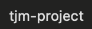
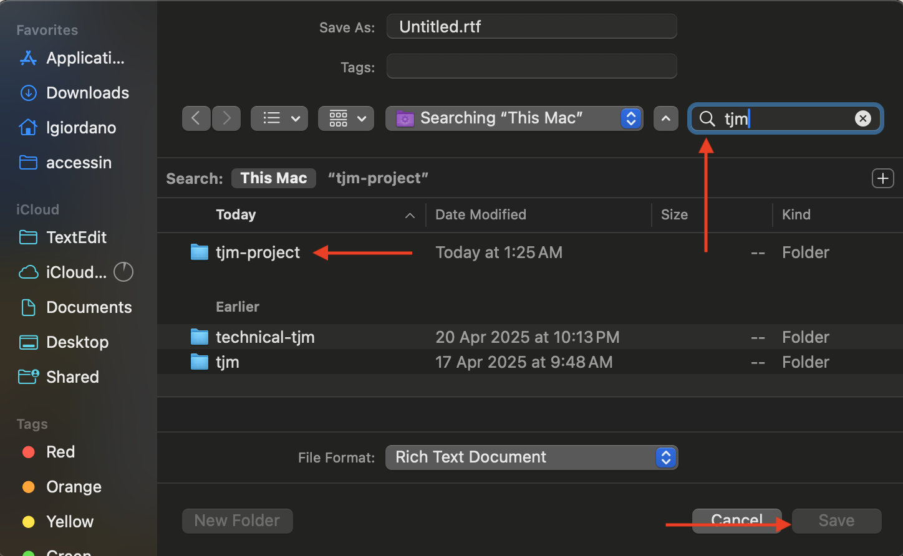

# Technical-TJM

This project is prepared to run on MacOS, in future iterations implementations for Linux and Windows will be added.

### SETUP THE PROJECT
---
 ***Run `make setup`***

This will create the virtual environment. It will install the project and create the necessary folders.

Add the screenshots to the resources folder with the following names:

- search.png 
- search.png 
- search.png 

---

### RUN THE PROJECT

 ***Run `make run`***

 This will launch the virtual environment and run the script.

Optionally, you can pass the parameter for how many posts will be read from the API.

Add the POST_AMOUNT= parameter (10 are read by default).
`make run POST_AMOUNT=5`

---

### REMOVE THE PROJECT

 ***Run `make clean`***

This will remove the virtual environment from your computer.